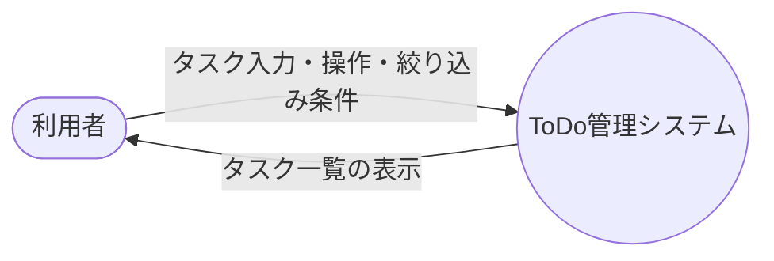
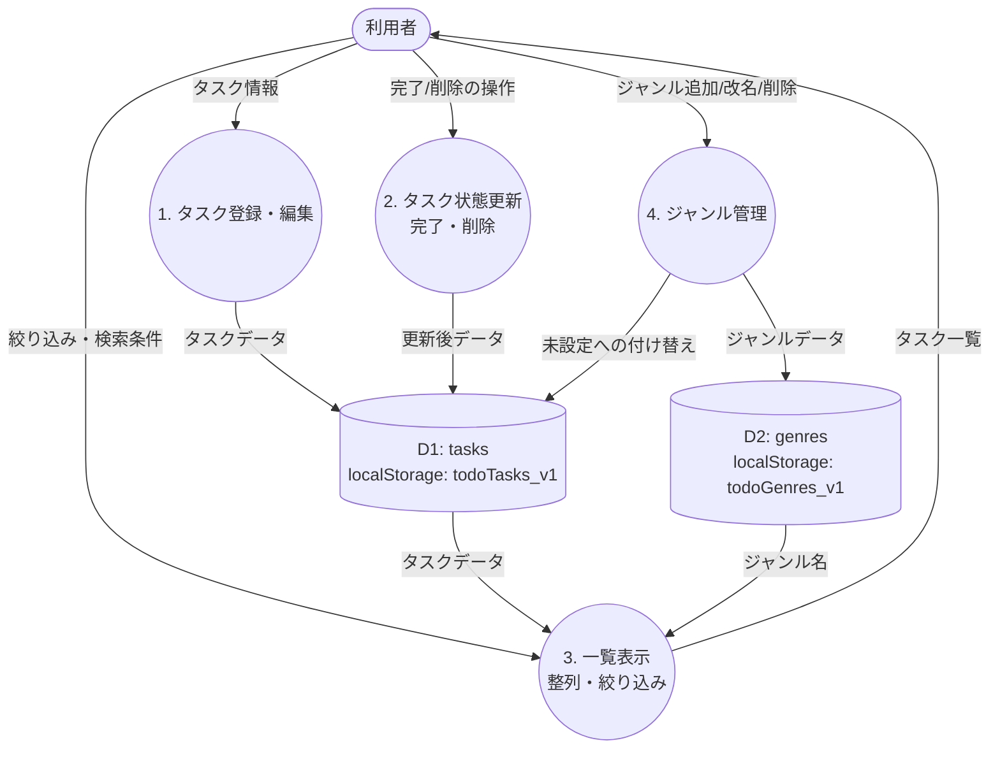

# DFD（データフロー図）

| 項目 | 内容 |
| --- | --- |
| システム名 | ToDoアプリ |
| 班番号・氏名 | 6班　蔭川真怜・木村奏太・谷川悠・西畑仁太郎 |
| 提出日 | 　年　月　日 |

---

## 1. 全体の図（コンテキストダイアグラム／レベル0）

---

## 2. 中身を分けた図（レベル1）

---

## 3. 図の説明

| プロセス | 何をするか |
| --- | --- |
| 1. タスク登録・編集 | 利用者が入力したタスク（名前・メモ・締切・重要度・ジャンル）を受け取り、tasks に追加・上書きして保存する |
| 2. タスク状態更新 | チェック操作で完了／未完了を切り替えたり、タスクを削除したりして tasks を更新・保存する |
| 3. 一覧表示 | tasks を読み出し、締切でセクション分けし、重要度・ジャンル・キーワードで絞り込んで画面に表示する |
| 4. ジャンル管理 | ジャンルの追加・改名・削除を行い genres を更新する。削除時は該当タスクのジャンルを未設定に付け替える |

### データストアの説明

| データストア | 内容 |
| --- | --- |
| D1: tasks（`todoTasks_v1`） | タスクの配列 `{ title, note, due, priority, genre, completed }` |
| D2: genres（`todoGenres_v1`） | ジャンルの配列 `{ id, name }` |
