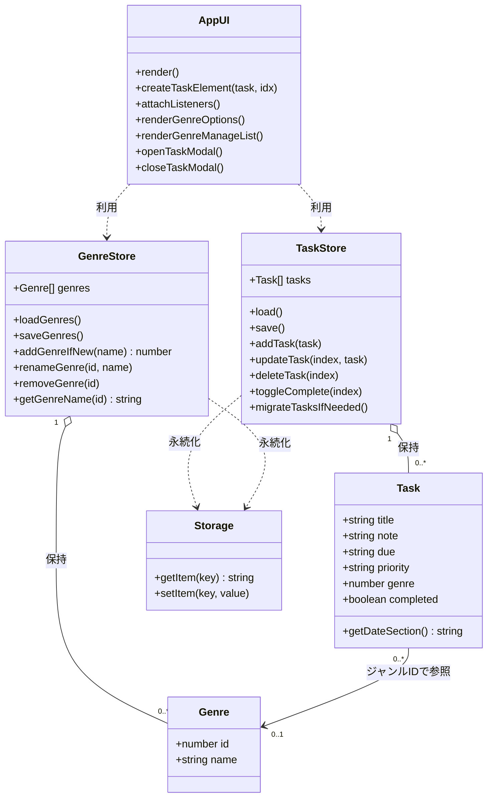

# UMLクラス図

| 項目 | 内容 |
| --- | --- |
| システム名 | ToDoアプリ |
| 班番号 | 6班 |
| 班員 | 蔭川真怜・木村奏太・谷川悠・西畑仁太郎 |
| 提出日 | 2026年 8月 6日 |

---

## 1. クラス図

---

## 2. クラスの説明

| クラス | 何を表すか | 持っているデータ | できること |
| --- | --- | --- | --- |
| Task | タスク1件 | title, note, due, priority, genre, completed | 締切から表示セクションを判定する |
| Genre | ジャンル1件 | id, name | （データの器） |
| TaskStore | タスク全体の管理役 | tasks（配列） | 読込・保存・追加・編集・削除・完了切替・旧データ移行 |
| GenreStore | ジャンル全体の管理役 | genres（配列） | 読込・保存・追加・改名・削除・ID→名前変換 |
| AppUI | 画面の描画と操作の受付役 | （DOM要素の参照） | 一覧描画・要素生成・イベント登録・モーダル開閉 |
| Storage | localStorage の入出力窓口 | （キーと値） | 値の読み書き（getItem / setItem） |

### 関係の説明

- **TaskStore ◇— Task**：TaskStore は複数の Task を配列として保持する（集約）。
- **GenreStore ◇— Genre**：GenreStore は複数の Genre を配列として保持する（集約）。
- **Task —▷ Genre**：各 Task はジャンルの `id`（数値）を持ち、対応する Genre を参照する。未設定のときは `null`。
- **AppUI ┄▷ TaskStore / GenreStore**：AppUI は両ストアを使って画面を組み立てる（依存）。
- **TaskStore / GenreStore ┄▷ Storage**：各ストアは Storage を通じて localStorage に保存・復元する（依存）。
